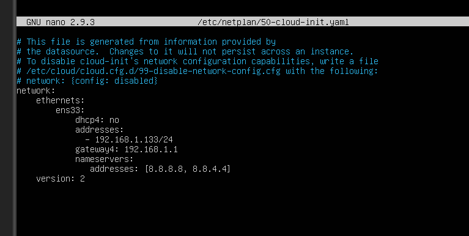

Lab 3

Config ip estática en servidor


> Para copiar


```
 network:
    ethernets:
        ens33:
            dhcp4: no
            addresses:
              - 192.168.1.133/24
            gateway4: 192.168.1.1
            nameservers:
               addresses: [8.8.8.8, 8.8.4.4]
    version: 2
```
* * *
>IP
`192.168.1.133`
* * *

>Cambiar a mirror global
`sudo sed -i 's|http://co.|http://|g' /etc/apt/sources.list`
O a mano modificar el archivo en: 
`sudo nano /etc/apt/sources.list`
`sudo apt-get update`
* * *

> Descargar videos desde consola
`sudo apt install youtube-dl`
`youtube-dl https://www.youtube.com/watch?v=K74l26pE4YA`
`youtube-dl youtube-dl https://www.youtube.com/watch?v=a0glBQXOcl4`
[Resto de funciones Youtube-dl](https://linoxide.com/linux-how-to/install-use-youtube-dl-ubuntu/)
* * *
> Conexión vía SSH
`ssh infracom@192.168.1.133`
`exit` para salir

* * *

[revisar](https://stackoverflow.com/questions/9382045/send-a-file-through-sockets-in-python)
